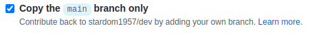

= À la découverte de Git Flow 2
:author: par Dominique Martel
:description: Une illustration du processus GitFlow pour un Pull Request liée à la révision de code.

:keywords: tutoriel, GitFlow, révision, code, collaboration

:toc:
:toc-title: Table des matières
== Introduction

Ce texte document sommairement le flot de travail d'un Pull Request (pr) du point de vue des deux parties impliquées :

* l'originateur du pr; dans ce document le **requérant**

* le propriétaire du repo sur GitHub; dans ce document le **propriétaire**

== Conventions d'écriture et abbréviations

* pr&#160;: « pull request ».

* repo&#160;: un « repository » dans GitHub.

* fork&#160;: un repo GitHub obtenu par la procédure « fork » d'un autre repo dans GitHub.

* requérant&#160;: la personne qui propose le pr.

* repo original&#160;: dans GitHub, le repo avec le contenu original.

* propriétaire&#160;: la personne propriétaire du contenu du repo original.

* répertoire source original&#160;: le répertoire (source) original sur l'ordinateur (du propriétaire du repo original).

* forked repo&#160;: le repo GitHub « forked » à partir du repo original et situé sur le GitHub du requérant.

* répertoir local clone&#160;: le répertoire obtenu par clônage du forked repo requérant situé sur l'ordinateur du requérant.

== Sommaire du processus
Le processus se décline de la manière suivante&#160;:

1. Créer un fork du repo propriétaire
2. Clôner le repo requérant
3. Créer une nouvelle branche
4. Effectuer les changements dans la nouvelle branche
5. Pousser les changements vers le fork
6. Créer le pr

== Étape 1 - créer un fork à partir du repo original
À titre d'exemple, supposons que Le *requérant* désire proposer des changements dans *dev*, le *repo original*. Bien entendu, le requérant n'est pas autorisé à modifier directement le code dans le repo original; il devra donc obteni sa propre copie du repo en créant un « fork » à partir de ce dernier. La procédure fork produit une copie conforme du  *repo original* dans le compte GitHub du requérant. Puisque le fork constitue en lui-même un repo, il contient tout l'historique des commandes _git_ et autres du repo.

Le figure 1 indique comment lancer la procédure fork à partir du repo original dans GitHub.

Figure 1 - La commande de création d'un fork sur repo original dans GitHub.

  --> CLIQUER sur + Create a new fork 
  et SUIVRE les indications
Note :
* Par défaut le nom du et la description du fork sont les mêmes que le repo original.

* Par défaut seule la branche main est copiée

Figure 2 - Copier seulement la branche main.

  --> CLIQUER sur ...

[Figure 3]
Figure 3 - Bouton de création du fork.

Le fork est créé dans 

== Étape 2 - Clôner le repo

Bien entendu le requérant peut dès maintenant effectuer des modification dans son fork, mais dans cet exemple

== Étape 3
== Étape 4
== Étape 5
== Étape 6

 
